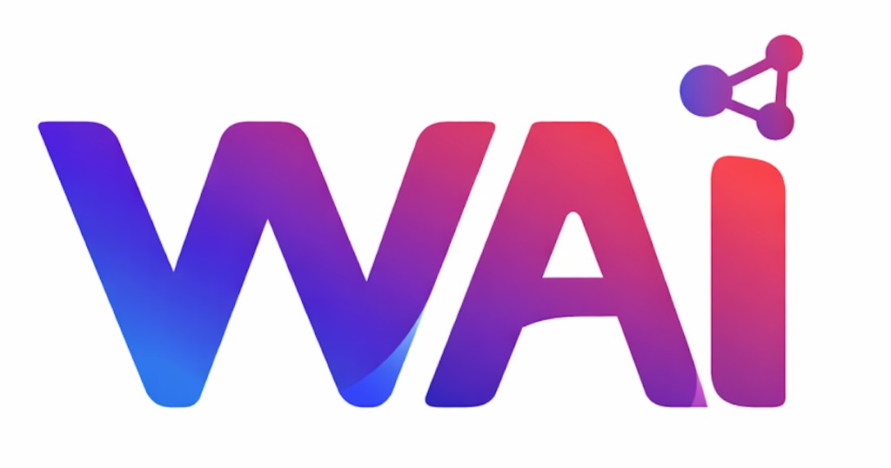

<p align="center">
  
</p>

<h1 align="center">WeeklyAI</h1>

<p align="center">
  <strong>Your AI product radar — built for the new roles of the AI era</strong><br/>
  <em>For AI founders, one-person companies, frontier deployment engineers, super individuals, and solution architects</em>
</p>

<p align="center">
  <a href="#-中文">中文</a> · <a href="#-english">English</a>
</p>

<p align="center">
  
  
  
  
  
  
  
</p>

<p align="center">
  <a href="https://weekly-ai-hub.vercel.app"><strong>Live Demo</strong></a> ·
  <a href="https://weekly-ai-api.vercel.app/api/v1/products/dark-horses"><strong>API</strong></a> ·
  <a href="https://weekly-ai-api.vercel.app/api/v1/products/feed/rss"><strong>RSS Feed</strong></a>
</p>

---

## 🇨🇳 中文

### 为什么需要 WeeklyAI？

AI 时代正在诞生全新的职业角色：**前沿部署工程师**在评估哪个 AI 产品能最快落地；**一人公司** 创始人在寻找能 10x 杠杆自己的 AI 工具；**超级个体**在筛选值得 all-in 的赛道；**AI 初创团队**在研究竞品找灵感；**解决方案架构师**在追踪能集成到企业方案中的新产品。

但现有工具的共同盲点：

- **没有为决策者设计的评分体系** — 只有列表，没有判断
- **完全忽视中国 AI 生态** — 全球第二大市场的信息为零
- **无法识别"早期黑马"** — 只能记录已经爆火的产品
- **没有"为什么重要"** — 列了产品但不告诉你商业背景

**WeeklyAI 不同。** 我们用双 AI 引擎自动扫描全球 6 大地区，给每个产品打出量化评分（2-5 分），并附上"为什么重要"——融资金额、创始人背景、增长信号、品类创新——让你像读情报简报一样 5 分钟做出判断。

### 谁在用 WeeklyAI？

| 角色 | 使用场景 |
|------|---------|
| **AI 初创创始人** | 发现竞品动态，找到蓝海方向，追踪同赛道融资 |
| **一人公司 / 超级个体** | 筛选能 10x 效率的 AI 工具，评估构建 vs 购买 |
| **前沿部署工程师** | 追踪可落地的 AI 产品，评估技术成熟度和集成难度 |
| **解决方案架构师** | 追踪新产品 API 和集成能力，评估企业级就绪度 |
| **VC / 投资人** | 发现早期黑马，追踪全球 AI 融资动态 |

### vs 竞品

| 维度 | Product Hunt | TAAFT / Futurepedia | Ben's Bites | **WeeklyAI** |
|------|-------------|-------------------|------------|-------------|
| 数据来源 | 用户提交 | 手动收录 | 编辑策展 | **双 AI 引擎自动扫描** |
| 中国市场 | — | — | — | **智谱 GLM + 中国媒体源** |
| 量化评分 | — | — | — | **5 级评分体系** |
| "为什么重要" | — | — | 部分 | **每条必须附带** |
| 硬件专项 | — | — | — | **独立评分维度** |
| AI 对话 | — | — | — | **Perplexity Sonar 流式问答** |
| 更新频率 | 实时(用户驱动) | 周/月 | 日刊 | **每日自动流水线** |

### 核心能力

| 能力 | 描述 |
|------|------|
| **全球六区覆盖** | 美国 · 中国 · 欧洲 · 日韩 · 东南亚 · 全球硬件，多语言原生搜索 |
| **双 AI 引擎** | Perplexity Sonar（全球）+ 智谱 GLM-4.7（中国），智能路由，互为回退 |
| **5 级评分体系** | 融资 × 创始人 × 品类创新 × 社区热度 × 增长信号，量化评判 |
| **硬件专项发掘** | 创新形态硬件（可穿戴 / 桌面 / 随身），40% 形态创新权重 |
| **AI 对话助手** | 基于 Perplexity Sonar 的流式对话，实时注入产品数据上下文 |
| **应用内阅读** | 新闻/博客一键预加载阅读，无需跳转外链 |
| **中英双语** | 前端一键切换，语言偏好自动记忆 |
| **Swipe 发现** | Tinder 式卡片交互，30 秒筛出黑马 |
| **10 步自动流水线** | 发现 → 发布 → 回填 → 解析 → 验证 → 去重 → Logo → 新闻 → 社交信号 → 同步 |

### 产品分层

```
 5分  现象级    融资 >$100M / 品类开创 / 社交爆火
 4分  黑马      融资 >$30M / 顶级 VC / ARR >$10M
 3分  潜力股    融资 $1M-$5M / ProductHunt 上榜
 2分  早期观察  有创新点 / 数据不足但值得追踪
```

### 技术架构

```
┌─────────────────────────────────────────────────────────────┐
│                    Frontend (Next.js 16)                     │
│  React 19 · TypeScript · SWR · Zod · p5.js · i18n          │
├─────────────────────────────────────────────────────────────┤
│                    Backend (Flask 3.0)                       │
│  REST API · SSE Streaming · Rate Limiting · MongoDB/JSON    │
├──────────────────────┬──────────────────────────────────────┤
│  Perplexity Sonar    │    Zhipu GLM-4.7                     │
│  (US/EU/JP/KR/SEA)   │    (China · search_pro)              │
├──────────────────────┴──────────────────────────────────────┤
│              MongoDB 7 / JSON Fallback                      │
├─────────────────────────────────────────────────────────────┤
│  10-Step Daily Pipeline · launchd · Docker · Vercel         │
└─────────────────────────────────────────────────────────────┘
```

### 快速启动

```bash
git clone https://github.com/ZhanlinCui/weekly.ai.git && cd weekly.ai

# 前端
cd frontend-next && npm install && npm run dev    # localhost:3001

# 后端
cd backend && pip install -r requirements.txt && python run.py  # localhost:5000

# 爬虫 (可选)
cd crawler && python3 tools/auto_discover.py --region all --dry-run
```

### 环境变量

| 变量 | 必需 | 说明 |
|------|------|------|
| `PERPLEXITY_API_KEY` | 全球区 | Perplexity Sonar API Key |
| `ZHIPU_API_KEY` | 中国区 | 智谱 GLM-4.7 API Key |
| `MONGO_URI` | 可选 | MongoDB 连接（不设则用 JSON 回退） |
| `NEXT_PUBLIC_API_BASE_URL` | 部署时 | 前端 API 地址 |

---

## 🇺🇸 English

### Why WeeklyAI?

The AI era is creating entirely new roles: **frontier deployment engineers** evaluating which AI products ship fastest; **one-person company founders** looking for 10x-leverage tools; **super individuals** screening which lanes to go all-in on; **AI startup teams** studying competitors and finding inspiration; **solution architects** tracking products they can integrate into enterprise stacks.

Existing tools share the same blind spots:

- **No scoring system designed for decision-makers** — just lists, no judgment
- **Zero coverage of China's AI ecosystem** — the world's second-largest market, invisible
- **Can't identify "early dark horses"** — only records products after they've blown up
- **No "why it matters"** — lists products without business context

**WeeklyAI is different.** We use dual AI engines to scan 6 global regions daily, score every product quantitatively (2–5 pts), and attach "why it matters" — funding, founder background, growth signals, category innovation — so you read it like an intelligence briefing and make decisions in 5 minutes.

### Who uses WeeklyAI?

| Role | Use Case |
|------|----------|
| **AI Startup Founders** | Track competitor moves, find blue ocean opportunities, monitor funding |
| **One-Person Companies / Super Individuals** | Screen 10x-efficiency AI tools, evaluate build vs buy |
| **Frontier Deployment Engineers** | Track shippable AI products, assess tech maturity and integration difficulty |
| **Solution Architects** | Track new product APIs and integration readiness, evaluate enterprise-grade status |
| **VCs / Investors** | Discover early dark horses, track global AI funding dynamics |

### vs Competitors

| Dimension | Product Hunt | TAAFT / Futurepedia | Ben's Bites | **WeeklyAI** |
|-----------|-------------|-------------------|------------|-------------|
| Data Source | User-submitted | Manual curation | Editorial | **Dual AI engine auto-scan** |
| China Market | — | — | — | **GLM + Chinese media sources** |
| Scoring | — | — | — | **5-tier quantitative system** |
| "Why it matters" | — | — | Partial | **Required for every entry** |
| Hardware Track | — | — | — | **Dedicated scoring dimensions** |
| AI Chat | — | — | — | **Perplexity Sonar streaming Q&A** |
| Update Frequency | Real-time (user) | Weekly/Monthly | Daily | **Daily automated pipeline** |

### Core Capabilities

| Capability | Description |
|-----------|------------|
| **6-Region Coverage** | US · China · Europe · Japan/Korea · Southeast Asia · Global Hardware |
| **Dual AI Engine** | Perplexity Sonar (global) + Zhipu GLM-4.7 (China), smart routing with fallback |
| **5-Tier Scoring** | Funding × Founder × Category Innovation × Community Buzz × Growth Signals |
| **Hardware Discovery** | Innovative form factors (wearables / desktop / portable), 40% innovation weight |
| **AI Chat Assistant** | Perplexity Sonar streaming chat with real-time product data injection |
| **In-App Reading** | Blog/news articles pre-fetched and rendered in-app, no external redirects |
| **Bilingual (ZH/EN)** | One-click language switch, preference auto-saved |
| **Swipe Discovery** | Tinder-style card interaction, 30 seconds to surface dark horses |
| **10-Step Pipeline** | Discover → Publish → Backfill → Resolve → Validate → Dedup → Logo → News → Social → Sync |

### Scoring Tiers

```
 5 pts  Phenomenal   Funding >$100M / Category creator / Viral
 4 pts  Dark Horse   Funding >$30M / Top-tier VC / ARR >$10M
 3 pts  Rising Star  Funding $1M–$5M / ProductHunt featured
 2 pts  Early Watch  Clear innovation / Insufficient data but worth tracking
```

### Architecture

```
┌─────────────────────────────────────────────────────────────┐
│                    Frontend (Next.js 16)                     │
│  React 19 · TypeScript · SWR · Zod · p5.js · i18n          │
├─────────────────────────────────────────────────────────────┤
│                    Backend (Flask 3.0)                       │
│  REST API · SSE Streaming · Rate Limiting · MongoDB/JSON    │
├──────────────────────┬──────────────────────────────────────┤
│  Perplexity Sonar    │    Zhipu GLM-4.7                     │
│  (US/EU/JP/KR/SEA)   │    (China · search_pro)              │
├──────────────────────┴──────────────────────────────────────┤
│              MongoDB 7 / JSON Fallback                      │
├─────────────────────────────────────────────────────────────┤
│  10-Step Daily Pipeline · launchd · Docker · Vercel         │
└─────────────────────────────────────────────────────────────┘
```

### Quick Start

```bash
git clone https://github.com/ZhanlinCui/weekly.ai.git && cd weekly.ai

# Frontend
cd frontend-next && npm install && npm run dev    # localhost:3001

# Backend
cd backend && pip install -r requirements.txt && python run.py  # localhost:5000

# Crawler (optional)
cd crawler && python3 tools/auto_discover.py --region all --dry-run
```

### Environment Variables

| Variable | Required | Description |
|----------|----------|------------|
| `PERPLEXITY_API_KEY` | Global regions | Perplexity Sonar API Key |
| `ZHIPU_API_KEY` | China region | Zhipu GLM-4.7 API Key |
| `MONGO_URI` | Optional | MongoDB connection (falls back to JSON if unset) |
| `NEXT_PUBLIC_API_BASE_URL` | Deployment | Frontend API base URL |

---

## Project Structure

```
weekly.ai/
├── frontend-next/        Next.js 16 + React 19 (primary frontend)
│   ├── src/app/          Pages (home, product, blog, discover, search)
│   ├── src/components/   Components (chat, home, product, blog, layout)
│   ├── src/i18n/         Bilingual system (zh/en)
│   ├── src/lib/          API client, product utils, schemas
│   └── src/styles/       Design tokens, base, home, chat, reader
├── backend/              Flask 3.0 API
│   ├── app/routes/       products, search, chat
│   └── app/services/     repository, service, filters, sorting, chat, reader
├── crawler/              AI Discovery Engine
│   ├── tools/            33+ automation scripts
│   ├── utils/            Perplexity + GLM clients
│   ├── prompts/          Search + Analysis prompts
│   ├── spiders/          17 crawlers (YouTube, X, HN, PH...)
│   └── data/             Product data (featured, dark horses, blogs)
├── ops/scheduling/       Daily pipeline (launchd + cron)
├── tests/                13+ Python test files + Vitest
└── docker-compose.yml    Full-stack containerization
```

## Deployment

| Service | Platform | URL |
|---------|----------|-----|
| Frontend | Vercel (Next.js) | [weekly-ai-hub.vercel.app](https://weekly-ai-hub.vercel.app) |
| Backend | Vercel (Serverless Python) | [weekly-ai-api.vercel.app](https://weekly-ai-api.vercel.app) |
| Database | MongoDB Atlas / JSON Fallback | Configurable |

## API Endpoints

| Endpoint | Description |
|----------|------------|
| `GET /products/dark-horses` | Dark horses (4–5 pts) |
| `GET /products/rising-stars` | Rising stars (2–3 pts) |
| `GET /products/weekly-top` | Weekly Top 15 |
| `GET /products/trending` | Trending Top 5 |
| `GET /products/today` | Today's picks |
| `GET /products/<id>` | Product detail |
| `GET /products/<id>/related` | Related products |
| `GET /products/blogs` | News & blogs |
| `GET /products/categories` | Category list |
| `GET /products/industry-leaders` | Industry leader reference |
| `GET /search?q=xxx` | Full-text search |
| `POST /chat` | AI chat (SSE / JSON) |
| `GET /products/feed/rss` | RSS feed |

## Contributing

1. Fork and create your branch
2. Keep changes scoped and include clear rationale in PR description
3. Follow module boundaries: backend in `backend/app/services`, crawler in `crawler/tools`, frontend in `frontend-next/src`
4. Provide validation screenshots or API examples for UI/API changes

## License

MIT

---

<p align="center">
  <strong>WeeklyAI</strong> — Your AI product radar. Built for the builders of tomorrow.<br/>
  Solo-built · ~$50/mo API cost · Dual AI engines · 6 global regions · 10-step daily pipeline
</p>
